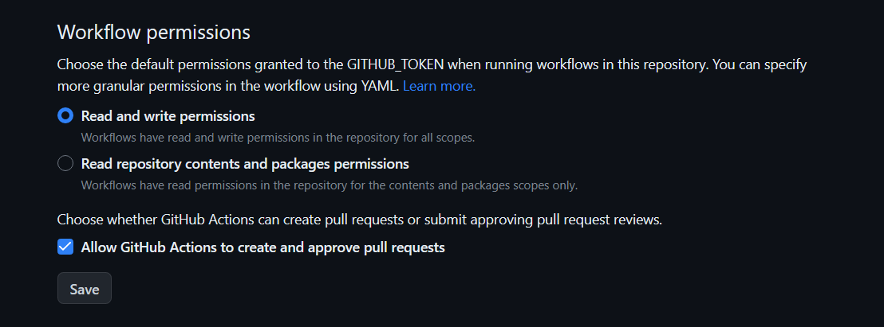

# 使用 vite + svelte 的思源笔记插件示例

[English](./README.md)


> 本例同 [siyuan/plugin-sample](https://github.com/siyuan-note/plugin-sample) [v0.3.4](https://github.com/siyuan-note/plugin-sample/tree/v0.3.4)

1. 使用 vite 打包
2. 使用符号链接、而不是把项目放到插件目录下的模式进行开发
3. 内置对 svelte 框架的支持
  
   > 如果不想要 svelte，请移步 [frostime/plugin-sample-vite](https://github.com/frostime/plugin-sample-vite)

4. 提供一个github action 模板，能自动生成package.zip并上传到新版本中

## 开始

1. 通过 <kbd>Use this template</kbd> 按钮将该库文件复制到你自己的库中，请注意库名必须和插件名称一致，默认分支必须为 `main`
2. 将你的库克隆到本地开发文件夹中
    * 注意: 同 `plugin-sample` 不同, 本样例并不推荐直接把代码下载到 `{workspace}/data/plugins/`
3. 安装 [NodeJS](https://nodejs.org/en/download) 和 [pnpm](https://pnpm.io/installation)，然后在开发文件夹下执行 `pnpm i` 安装所需要的依赖
3. **自动创建符号链接**
    - 打开思源笔记, 确保思源内核正在运行
    - 运行 `pnpm run make-link`, 脚本会自动检测所有思源的工作空间, 请在命令行中手动输入序号以选择工作空间
        ```bash
        >>> pnpm run make-link
        > plugin-sample-vite-svelte@0.0.3 make-link H:\SrcCode\开源项目\plugin-sample-vite-svelte
        > node  --no-warnings ./scripts/make_dev_link.js

        "targetDir" is empty, try to get SiYuan directory automatically....
        Got 2 SiYuan workspaces
        [0] H:\Media\SiYuan
        [1] H:\临时文件夹\SiYuanDevSpace
        Please select a workspace[0-1]: 0
        Got target directory: H:\Media\SiYuan/data/plugins
        Done! Created symlink H:\Media\SiYuan/data/plugins/plugin-sample-vite-svelte
        ```
4. **手动创建符号链接**
    - 打开 `./scripts/make_dev_link.js` 文件，更改 `targetDir` 为思源的插件目录 `<siyuan workspace>/data/plugins`
    - 运行 `pnpm run make-link` 命令, 如果看到类似以下的消息，说明创建成功:
      ```bash
      ❯❯❯ pnpm run make-link
      > plugin-sample-vite-svelte@0.0.1 make-link H:\SrcCode\plugin-sample-vite-svelte
      > node ./scripts/make_dev_link.js

      Done! Created symlink H:/SiYuanDevSpace/data/plugins/plugin-sample-vite-svelte
      ```
5. **设置环境变量创建符号链接**
    - 你也可以设置系统的环境变量 `SIYUAN_PLUGIN_DIR` 为 `/data/plugins` 的路径
6. 执行 `pnpm run dev` 进行实时编译
7. 在思源中打开集市并在下载选项卡中启用插件


> 注意由于使用的 make-link 脚本依赖于 `fetch`，所以如果想要使用 make-link **请保证至少安装 v18 版本的 nodejs**


## 国际化

国际化方面我们主要考虑的是支持多语言，具体需要完成以下工作：

* 插件自身的元信息，比如插件描述和自述文件
  * plugin.json 中的 `description` 和 `readme` 字段，以及对应的 README*.md 文件
* 插件中使用的文本，比如按钮文字和提示信息
  * public/i18n/*.json 语言配置文件
  * 代码中使用 `this.i18.key` 获取文本
* 最后在 plugin.json 中的 `i18n` 字段中声明该插件支持的语言
* yaml 支持
  * 本模板特别支持基于 Yaml 语法的 I18n，见 `public/i18n/zh_CN.yaml`
  * 编译时，会自动把定义的 yaml 文件翻译成 json 文件放到 dist 或 dev 目录下

建议插件至少支持英文和简体中文，这样可以方便更多人使用。

## plugin.json

```json
{
  "name": "plugin-sample-vite-svelte",
  "author": "frostime",
  "url": "https://github.com/siyuan-note/plugin-sample-vite-svelte",
  "version": "0.1.3",
  "minAppVersion": "2.8.8",
  "backends": ["windows", "linux", "darwin"],
  "frontends": ["desktop"],
  "displayName": {
    "en_US": "Plugin sample with vite and svelte",
    "zh_CN": "插件样例 vite + svelte 版"
  },
  "description": {
    "en_US": "SiYuan plugin sample with vite and svelte",
    "zh_CN": "使用 vite 和 svelte 开发的思源插件样例"
  },
  "readme": {
    "en_US": "README_en_US.md",
    "zh_CN": "README.md"
  },
  "funding": {
    "openCollective": "",
    "patreon": "",
    "github": "",
    "custom": [
      "https://ld246.com/sponsor"
    ]
  },
  "keywords": [
    "sample", "示例"
  ]
}
```

* `name`：插件名称，必须和库名一致，且全局唯一（集市中不能有重名插件）
* `author`：插件作者名
* `url`：插件仓库地址
* `version`：插件版本号，建议遵循 [semver](https://semver.org/lang/zh-CN/) 规范
* `minAppVersion`：插件支持的最低思源笔记版本号
* `backends`：插件需要的后端环境，可选值为 `windows`, `linux`, `darwin`, `docker`, `android`, `ios` and `all`
  * `windows`：Windows 桌面端
  * `linux`：Linux 桌面端
  * `darwin`：macOS 桌面端
  * `docker`：Docker 端
  * `android`：Android 端
  * `ios`：iOS 端
  * `all`：所有环境
* `frontends`：插件需要的前端环境，可选值为 `desktop`, `desktop-window`, `mobile`, `browser-desktop`, `browser-mobile` and `all`
  * `desktop`：桌面端
  * `desktop-window`：桌面端页签转换的独立窗口
  * `mobile`：移动端
  * `browser-desktop`：桌面端浏览器
  * `browser-mobile`：移动端浏览器
  * `all`：所有环境
* `displayName`：模板显示名称，主要用于模板集市列表中显示，支持多语言
  * `default`：默认语言，必须存在
  * `zh_CN`、`en_US` 等其他语言：可选，建议至少提供中文和英文
* `description`：插件描述，主要用于插件集市列表中显示，支持多语言
  * `default`：默认语言，必须存在
  * `zh_CN`、`en_US` 等其他语言：可选，建议至少提供中文和英文
* `readme`：自述文件名，主要用于插件集市详情页中显示，支持多语言
  * `default`：默认语言，必须存在
  * `zh_CN`、`en_US` 等其他语言：可选，建议至少提供中文和英文
* `funding`：插件赞助信息
  * `openCollective`：Open Collective 名称
  * `patreon`：Patreon 名称
  * `github`：GitHub 登录名
  * `custom`：自定义赞助链接列表
* `keywords`：搜索关键字列表，用于集市搜索功能

## 打包

无论使用何种方式编译打包，我们最终需要生成一个 package.zip，它至少包含如下文件：

* i18n/*
* icon.png (160*160)
* index.css
* index.js
* plugin.json
* preview.png (1024*768)
* README*.md

## 上架集市

* 执行 `pnpm run build` 生成 package.zip
* 在 GitHub 上创建一个新的发布，使用插件版本号作为 “Tag
  version”，示例 https://github.com/siyuan-note/plugin-sample/releases
* 上传 package.zip 作为二进制附件
* 提交发布

如果是第一次发布版本，还需要创建一个 PR 到 [Community Bazaar](https://github.com/siyuan-note/bazaar) 社区集市仓库，修改该库的
plugins.json。该文件是所有社区插件库的索引，格式为：

```json
{
  "repos": [
    "username/reponame"
  ]
}
```

PR 被合并以后集市会通过 GitHub Actions 自动更新索引并部署。后续发布新版本插件时只需要按照上述步骤创建新的发布即可，不需要再
PR 社区集市仓库。

正常情况下，社区集市仓库每隔 1 小时会自动更新索引并部署，可在 https://github.com/siyuan-note/bazaar/actions 查看部署状态。

## 使用 Github action 自动发布

样例中自带了 github action，可以自动打包发布，请遵循以下操作：

1. 设置项目 `https://github.com/OWNER/REPO/settings/actions` 页面向下划到 **Workflow Permissions**，打开配置

    

2. 需要发布版本的时候，push 一个格式为 `v*` 的 tag，github 就会自动打包发布 release（包括 package.zip）

3. 默认使用保守策略进行 pre-release 发布，如果觉得没有必要，可以更改 release.yml 中的设置：

    ```yaml
    - name: Release
        uses: ncipollo/release-action@v1
        with:
            allowUpdates: true
            artifactErrorsFailBuild: true
            artifacts: 'package.zip'
            token: ${{ secrets.GITHUB_TOKEN }}
            prerelease: true # 把这个改为 false
    ```

## 如何去掉 svelte 依赖

> 无 Svelte 依赖版: https://github.com/frostime/plugin-sample-vite

本插件使用 vite 打包，并提供了 svelte 框架依赖。不过实际情况下可能有些开发者并不想要 svelte，只希望使用 vite 打包。

实际上你可以完全不做任何修改，就可以在不使用 svelte 的前提下使用这个模板。与 svelte 编译的编译相关的部分是以插件的形式载入到 vite 的工作流中，所以即使你的项目里面没有 svelte，也不会有太大的影响。

如果你执意希望删除掉所有 svelte 依赖以免它们污染你的工作空间，可以执行一下步骤:

1. 删掉 package.json 中的
    ```json
    {
      "@sveltejs/vite-plugin-svelte": "^2.0.3",
      "@tsconfig/svelte": "^4.0.1",
      "svelte": "^3.57.0"
    }
    ```
2. 删掉 `svelte.config.js` 文件
3. 删掉 `vite.config.js` 文件中的
    - 第六行: `import { svelte } from "@sveltejs/vite-plugin-svelte"`
    - 第二十行: `svelte(),`
4. 删掉 `tsconfig.json` 中 37 行 `"svelte"`
5. 重新执行 `pnpm i`


## 开发者须知

思源开发者需注意以下规范。

### 1. 读写文件规范

插件或者外部扩展如果有直接读取或者写入 data 下文件的需求，请通过调用内核 API 来实现，**不要自行调用 `fs` 或者其他 electron、nodejs API**，否则可能会导致数据同步时分块丢失，造成云端数据损坏。

相关 API 见: `/api/file/*`（例如 `/api/file/getFile` 等）。

### 2. Daily Note 属性规范

思源在创建日记的时候会自动为文档添加 custom-dailynote-yyyymmdd 属性, 以方便将日记文档同普通文档区分。

> 详情请见 [Github Issue #9807](https://github.com/siyuan-note/siyuan/issues/9807)。

开发者在开发手动创建 Daily Note 的功能时请注意：

- 如果调用了 `/api/filetree/createDailyNote` 创建日记，那么文档会自动添加这个属性，无需开发者特别处理。
- 如果是开发者代码手动创建文档（例如使用 `createDocWithMd` API 创建日记），请手动为文档添加该属性。

参考代码:

```ts
/*
 * Copyright (c) 2023 by frostime. All Rights Reserved.
 * @Author       : frostime
 * @Url          : https://github.com/frostime/siyuan-dailynote-today/blob/v1.3.0/src/func/dailynote/dn-attr.ts
 */

export function formatDate(date?: Date, sep=''): string {
    date = date === undefined ? new Date() : date;
    let year = date.getFullYear();
    let month = date.getMonth() + 1;
    let day = date.getDate();
    return `${year}${sep}${month < 10 ? '0' + month : month}${sep}${day < 10 ? '0' + day : day}`;
}

/**
 * Set custom attribute: `custom-dailynote-yyyyMMdd`: yyyyMMdd
 * https://github.com/siyuan-note/siyuan/issues/9807
 * @param doc_id Id of daily note
 */
export function setCustomDNAttr(doc_id: string, date?: Date) {
    let td = formatDate(date);
    let attr = `custom-dailynote-${td}`;
    // 构建 attr: td
    let attrs: { [key: string]: string } = {};
    attrs[attr] = td;
    serverApi.setBlockAttrs(doc_id, attrs);
}
```
